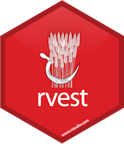

  # **What is Webscraping All About?**

  - ## The web is essentially a repository for data.
--

  - ## In order to store and display that data the websites have to be coded - generally in **HTML** or **Javascript**.
--

  ```{r, echo=FALSE, fig.align="center", out.width='90%'}
  knitr::include_graphics("images/fpl_home.jpg")
  ```
---
  # **What is Webscraping All About?**

  - ## The web is essentially a repository for data.

  - ## In order to store and display that data the websites have to be coded - generally in **HTML** or **Javascript**.
  
  ```{r, echo=FALSE, fig.align="center", out.width='90%'}
  knitr::include_graphics("images/html.jpg")
  ```
---
  # **What is Webscraping All About?**

  - ## The web is essentially a repository for data.

  - ## In order to store and display that data the websites have to be coded - generally in **HTML** or **Javascript**.

  - ## Once we become comfortable with the syntax of these languages any data on the web is obtainable!
---

class: inverse
background-image: url("images/cool.png")

  # **Why webscrape?**

  - ## Many important publications use novel datasets to determine previously unconsidered phenomena
       - #### Think Stanley Milgrams research into the _six degrees of seperation_.
       - #### One of the many studies into citation dynamics.
--
  - ## Some fields suffer from 'Zachary Karate Club Syndrome'
--
  ```{r, echo=FALSE, fig.align="center", out.width='50%'}
  knitr::include_graphics("images/zkcc.jpg")
  ```
---
class: inverse
background-image: url("images/cool.png")

  # **Why webscrape?**

  - ## Many important publications use novel datasets to determine previously unconsidered phenomena
       - #### Think Stanley Milgrams research into the _six degrees of seperation_.
       - #### One of the many studies into citation dynamics.

  - ## Some fields suffer from 'Zachary Karate Club Syndrome'

  - ## Give you a chance to do _research_ on something that really interests you.

---
  # **Key Packages**
  
  - ## In R there are two main packages used to actually scrape the data XML2 and rvest.
      ```{r, echo=FALSE, fig.align="center", out.width='20%'}
      
      ```
--
  - ## Python equivalents are beautifulsoup and requests.

---

class: inverse
  
  # Live coding 💻
  
  * Reddit
  
  * Wikipedia
  
  * Fantasy Premier League
  
  * High(ish)-Frequency Stock Prices
  
---
class: center
# **Summary**
  ## It isn't one-size-fits-all.
--

  ```{r, echo=FALSE, fig.align="center", out.width='50%'}
  
  ```
--

  ## 'Take these three items right here. You can have this. WD-40, vise grips, and some duct tape. Any man worth his salt can do half the household chores with just those three things.' Walt Kowalski

---

class: center, middle, inverse

# Thanks!

<br>
##brienj_